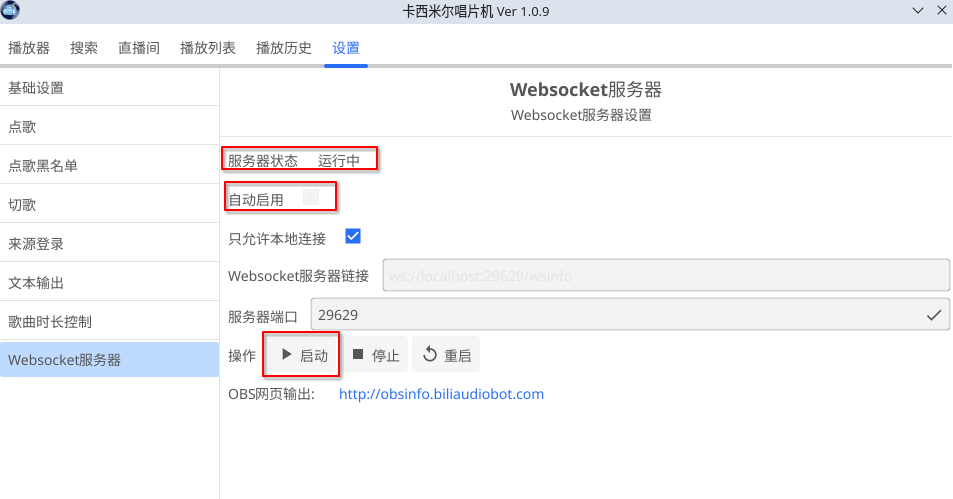

# 网页输出

## 开启网页输出

要使用网页输出功能，首先必须启动WebSocket服务器。具体操作步骤如下：

1. **导航至设置页面**：进入应用程序的设置页面。
2. **找到 WebSocket 服务器选项**：在设置菜单中，找到“WebSocket服务器”选项。
3. **启动WebSocket服务器**：点击“操作”按钮中的“启动”选项以启动WebSocket服务器。

当WebSocket服务器成功启动后，服务器状态栏中会显示 `运行中`，表示服务器已正常工作。

### 自动启动WebSocket服务器

如果希望每次启动点歌机时，WebSocket服务器也随之自动启动，可以通过设置页面勾选“自动启用”选项，实现自动启动功能。

### 预览网页输出样式

在WebSocket服务器成功启动后，可以在浏览器中打开网页预览界面，查看网页输出的样式。提供了两个入口以供选择：

- **入口1（推荐）**: [https://obsinfo.biliaudiobot.com](https://obsinfo.biliaudiobot.com)
- **入口2**: [http://38.147.187.72:1032/](http://38.147.187.72:1032/)

如果第一个入口无法访问，可以尝试使用第二个备用地址，如果都不行，请联系作者。

## 教程

TBD

## 附录1: 样式名称对照表

| 样式名称 (class name)  | 对应的内容      |
|--------------------|------------|
| `.media-title`     | 当前歌曲名字     |
| `.media-artist`    | 当前歌曲作者     |
| `.media-album`     | 当前歌曲专辑名称   |
| `.media-cover`     | 当前歌曲封面     |
| `.media-username`  | 当前点歌用户名    |
| `.current-time`    | 当前播放进度     |
| `.total-time`      | 当前歌曲总时间    |
| `.current-lyric`   | 当前歌词       |
| `.playlist-title`  | 点歌列表中的歌名   |
| `.playlist-artist` | 点歌列表中的歌曲作者 |
| `.playlist-album`  | 点歌列表中的歌曲专辑 |
| `.playlist-user`   | 点歌列表中的点歌用户 |
